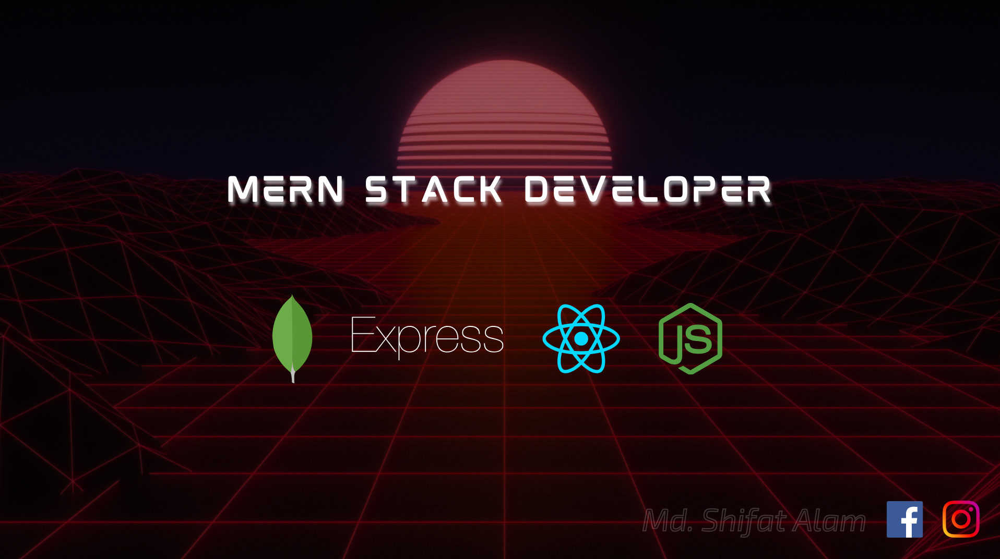

# 💫 About Me:
Hi, I am Md. Shifat Alam, an undergraduate student, pursuing BSc in Computer Science and Engineering degree at Rajshahi University of Engineering and Technology. Currently, I am on the road to be a MERN Stack Developer, exploring new technologies everyday. I want to polish my skills in Next.js, Node.js, Express.js, MongoDB. I am eager to collaborate with like minded individuals.

## 🌐 Socials:
  

# 💻 Tech Stack:
                      
# 📊 GitHub Stats:
 
 

## 🏆 GitHub Trophies

### 🔝 Top Contributed Repo

